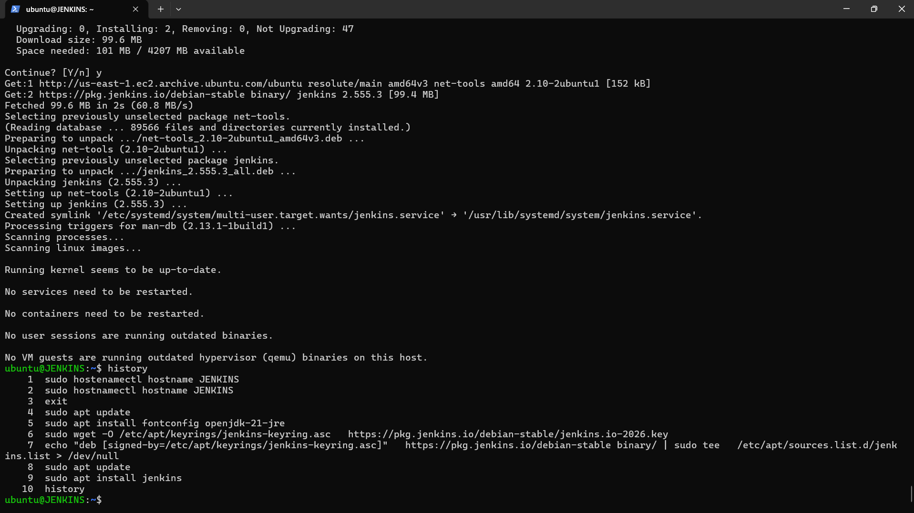
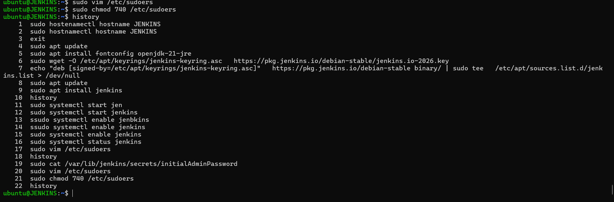
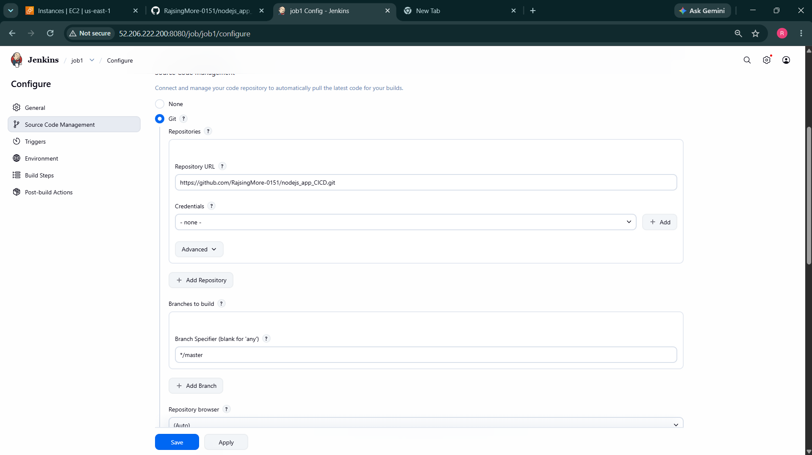
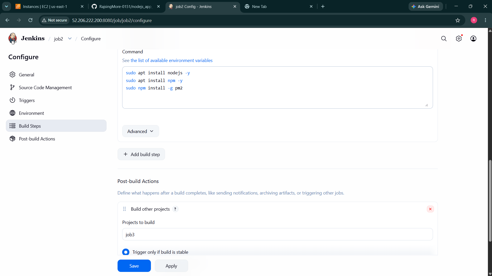
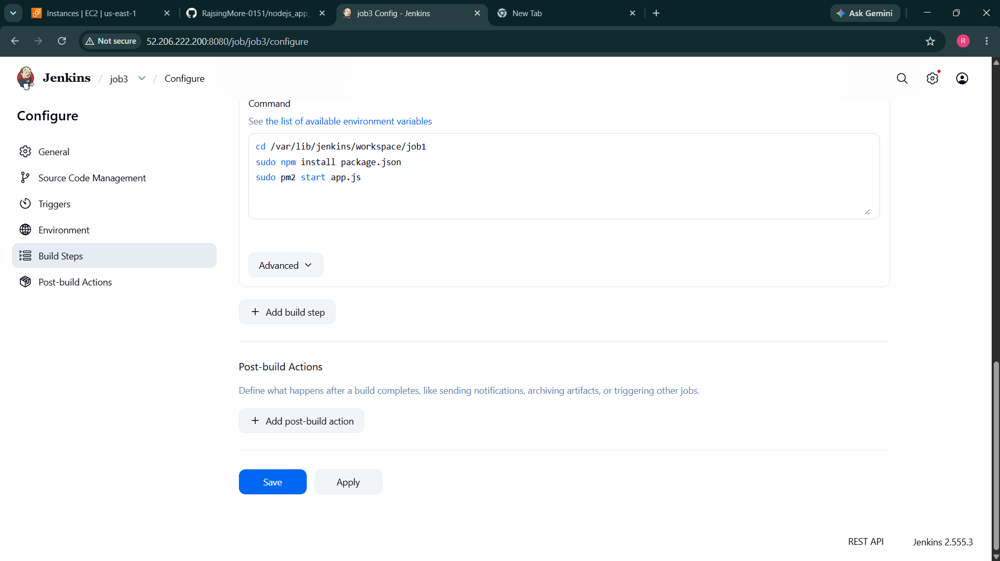
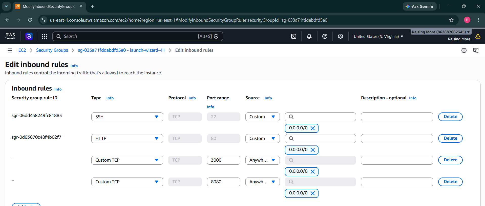
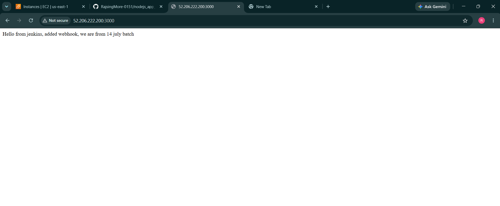

# Node.js Application Deployment using Jenkins CI/CD

## Project Overview

This project demonstrates a complete CI/CD pipeline for deploying a Node.js application using Jenkins on an AWS EC2 instance.

The pipeline automatically pulls source code from GitHub, installs dependencies, and deploys the application using PM2.

---

## Architecture

GitHub Repository → Jenkins Job 1 → Jenkins Job 2 → Jenkins Job 3 → PM2 → Node.js Application

---

## Technologies Used

* Node.js
* Jenkins
* Git & GitHub
* PM2
* AWS EC2 (Ubuntu)
* Linux Shell Scripting

---

## Project Workflow

### Job 1 – Source Code Management

* Connect Jenkins with GitHub repository.
* Pull latest source code from GitHub.
* Build is triggered manually.
Repository:
https://github.com/RajsingMore-0151/nodejs-app-delpoyed-using-jenkins-UI-CICD

---

### Job 2 – Environment Setup

Installs required packages:

```bash
sudo apt install nodejs -y
sudo apt install npm -y
sudo npm install -g pm2
```

---

### Job 3 – Application Deployment

Deploys the Node.js application.

```bash
cd /var/lib/jenkins/workspace/job1

npm install

pm2 start app.js --name node-app
```

---

## Jenkins Pipeline Flow

```text
GitHub
   │
   ▼
Job 1 (Pull Source Code)
   │
   ▼
Job 2 (Install Dependencies)
   │
   ▼
Job 3 (Deploy Application)
   │
   ▼
PM2 Process Manager
   │
   ▼
Node.js Application
```

---

## AWS Configuration

### Security Group Inbound Rules

| Port | Purpose             |
| ---- | ------------------- |
| 22   | SSH Access          |
| 8080 | Jenkins Dashboard   |
| 3000 | Node.js Application |
| 80   | HTTP Traffic        |

---

## Jenkins Installation

### Install Java

```bash
sudo apt update
sudo apt install fontconfig openjdk-21-jre -y
```

### Add Jenkins Repository

```bash
wget -O /etc/apt/keyrings/jenkins-keyring.asc \
https://pkg.jenkins.io/debian-stable/jenkins.io-2026.key

echo "deb [signed-by=/etc/apt/keyrings/jenkins-keyring.asc]" \
https://pkg.jenkins.io/debian-stable binary/ | \
sudo tee /etc/apt/sources.list.d/jenkins.list > /dev/null
```

### Install Jenkins

```bash
sudo apt update
sudo apt install jenkins -y
```

### Start Jenkins

```bash
sudo systemctl enable jenkins
sudo systemctl start jenkins
sudo systemctl status jenkins
```

### Get Initial Admin Password

```bash
sudo cat /var/lib/jenkins/secrets/initialAdminPassword
```

---

## Access Jenkins

```text
http://<EC2-Public-IP>:8080
```

Example:

```text
http://52.206.222.200:8080
```

---

## Access Application

```text
http://<EC2-Public-IP>:3000
```

Example:

```text
http://52.206.222.200:3000
```

---

## Sample Output

```text
Hello from Jenkins, added webhook, we are from 14 July batch
```

---

## Screenshots

### 1. Jenkins Installation



---

### 2. Commands Used During Installation



---

### 3. Jenkins Job 1 Configuration



---

### 4. Jenkins Job 2 Configuration



---

### 5. Jenkins Job 3 Configuration



---

### 6. AWS Security Group Configuration



---

### 7. Successfully Deployed Node.js Application



